# 14Finger
功能齐全的Web指纹扫描和分享平台,基于vue3+django前后端分离的web架构，并集成了长亭出品的rad爬虫的功能，内置了一万多条互联网开源的指纹信息。

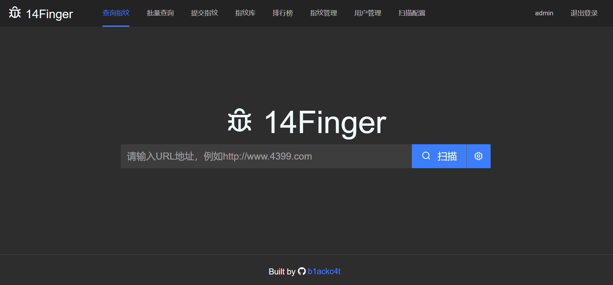

# 特点

1. **基于强大的rad爬虫**分析指纹，不局限于当前页面
2. 能够**执行js脚本**，动态js加载的应用也能扫描，比如Vue应用
3. **多线程**，**多进程**，速度尚可
4. **人性化的指纹提交**功能，指纹种类和信息划分精细，可供用户打造出自己的无敌指纹库
5. **批量爬虫**、**批量指纹**，均在后台处理，无需前台等待

# 平台部署

**如要部署到公网请修改django SECRET_KEY，在settings.py里，否则加密密钥泄漏会导致安全隐患**

## Docker一键部署

下载 [https://github.com/b1ackc4t/14Finger/releases](https://github.com/b1ackc4t/14Finger/releases) 里已经打包好的docker包，解压后在文件夹里执行：

``````bash
docker-compose up -d
``````

然后访问 **[http://127.0.0.1:7990]()** 即可，使用其他ip无法访问后端服务。

如要修改访问ip，请修改/14Finger-docker/nginx/html/config.json的BASE_URL_PROD，然后重启服务即可

## 手动启动

修改_14Finger/setting.py的数据库配置为自己的数据库

```python
DATABASES = {
    'default': {
        'ENGINE': 'django.db.backends.mysql',
        'NAME': '14finger',
        'USER': 'root',
        'PASSWORD': '',
        'HOST': '127.0.0.1',
        'PORT': '3306',
    }
}
```

导入14finger.sql文件后，分别启动前后端即可

前端 [https://github.com/b1ackc4t/14Finger-client](https://github.com/b1ackc4t/14Finger-client)

```bash
npm run dev
```

后端 [https://github.com/b1ackc4t/14Finger](https://github.com/b1ackc4t/14Finger)

```bash
pip install -r requirements.txt
python manage.py runserver
```

然后访问[http://127.0.0.1:3000/]()，修改ip的方法同docker部署一样

# 功能预览

## 单次查询

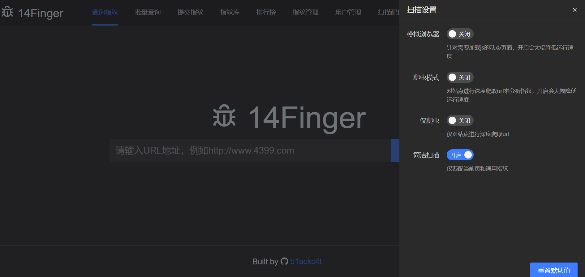


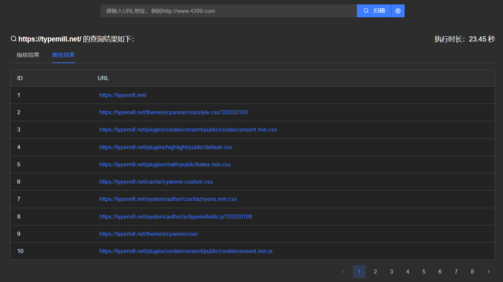

* 模拟浏览器用于执行js脚本
* 爬虫模式会先爬取出所有URL，在对每个URL进行指纹识别
* 仅爬虫则只会进行爬取，不进行指纹识别
* **默认开启简洁扫描**，避免动静太大，打草惊蛇


## 批量查询

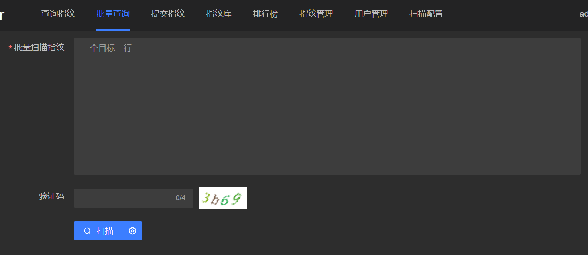

和单次查询**一样的设置选项**，只是在单次查询的基础上**加入了并发**，批量扫描URL列表。提交扫描后任务会在后台执行。

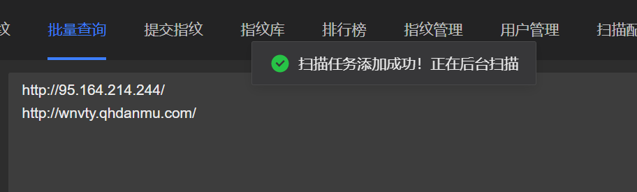

在**个人资料**页能够查看自己批量扫描任务的结果

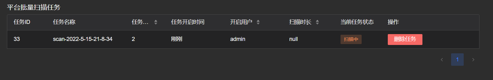

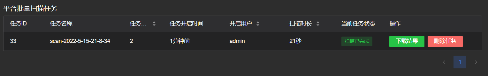

结果将会以**json文件**的形式被下载

## 指纹提交

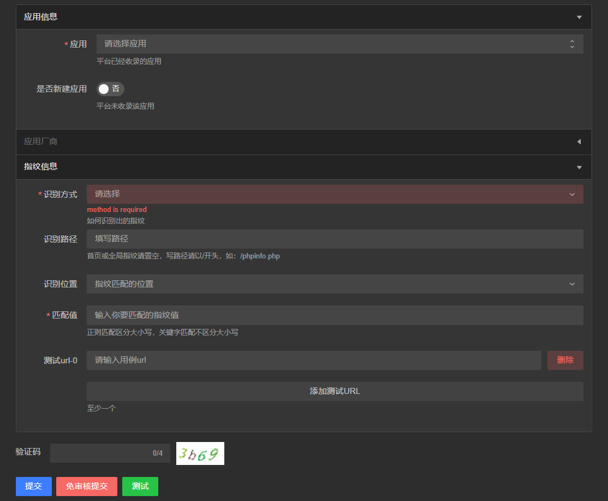

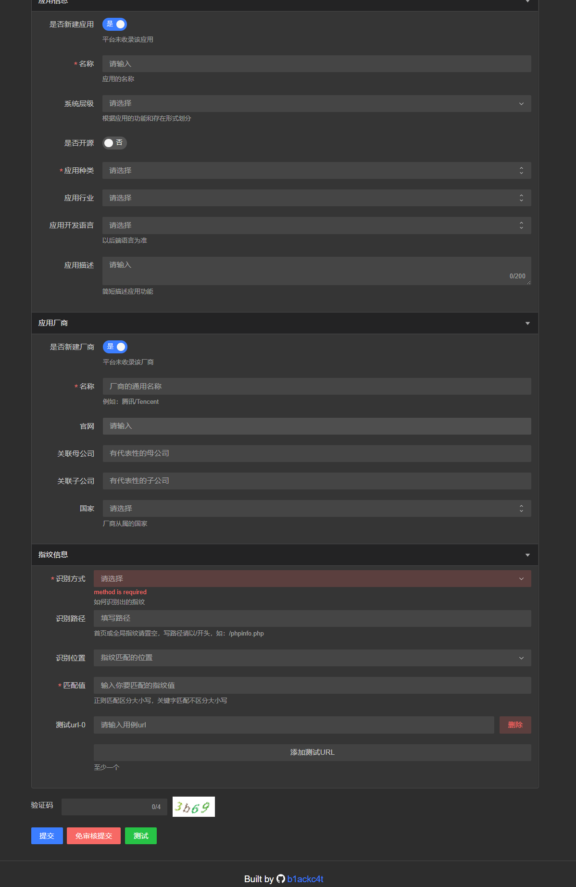

* 指纹信息设置清晰
* 应用可选平台已经存在的应用，也可以自己新建
* 指纹可以**即时进行测试**
* 管理员提交可以无需审核

## 指纹管理和检索

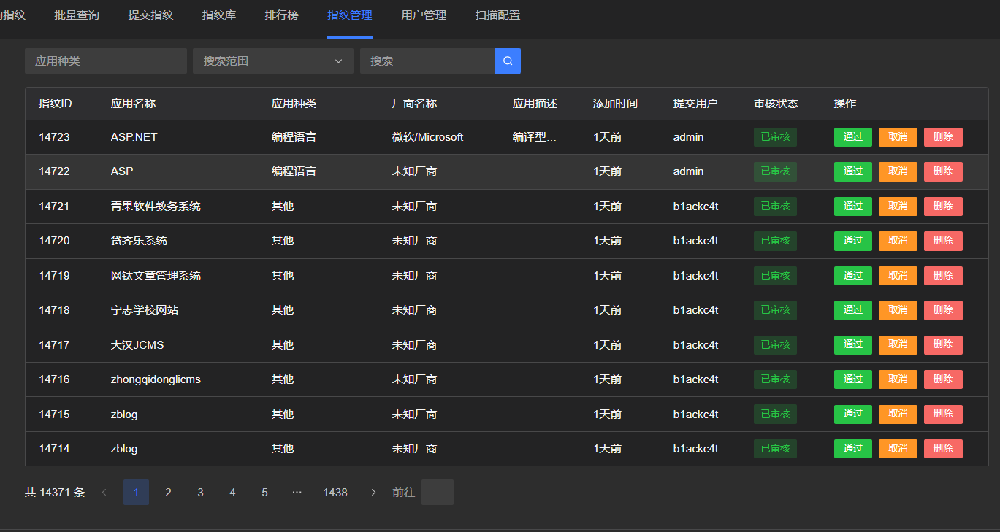

* 方便查阅指纹库
* 审核平台用户提交的指纹

## 平台配置

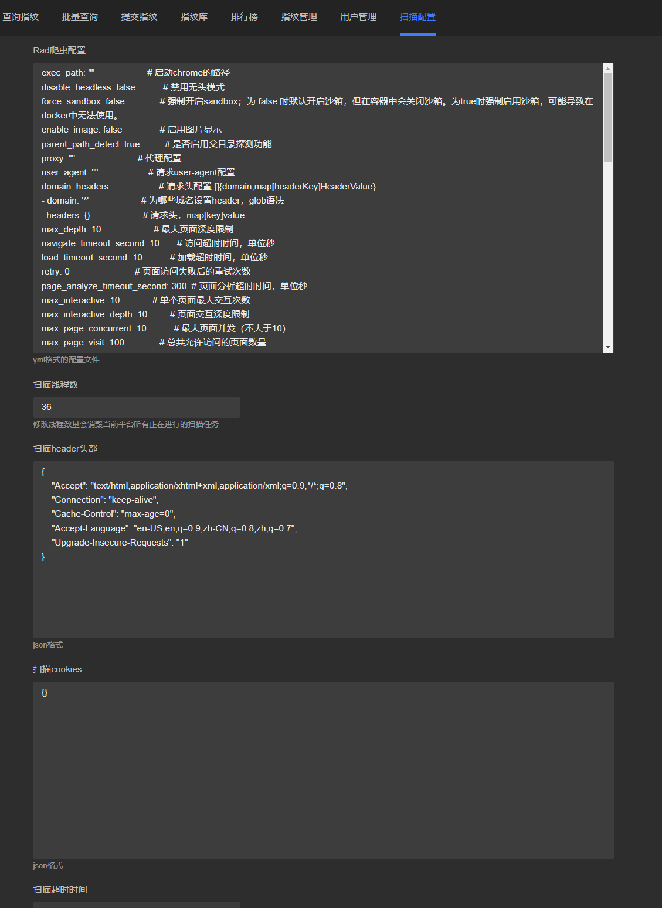

* 对平台扫描的一些基础信息进行配置

# 学习与参考

感谢前辈们优秀的项目，给予了很大的帮助

[https://github.com/TideSec/TideFinger](https://github.com/TideSec/TideFinger)

[https://github.com/Lucifer1993/cmsprint](https://github.com/Lucifer1993/cmsprint)

[https://github.com/chaitin/rad](https://github.com/chaitin/rad)

[https://github.com/EASY233/Finger](https://github.com/EASY233/Finger)

